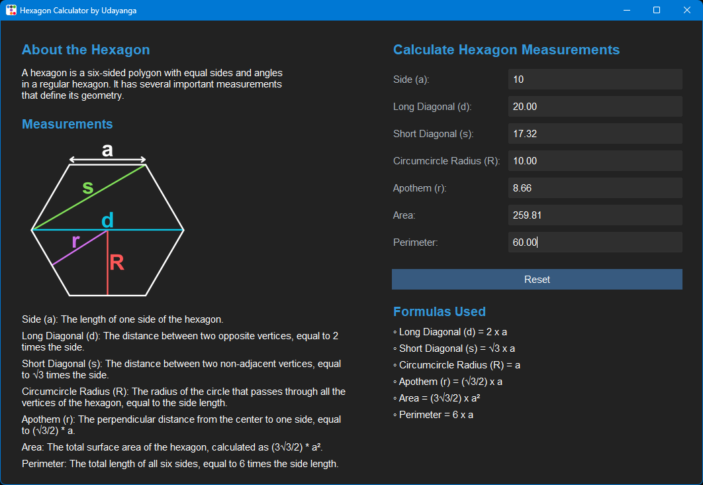

# Hexagon Calculator (Python Desktop App)

An interactive desktop application for calculating various measurements of a regular hexagon, built using Python and the ttkbootstrap library for a modern, Bootstrap-like graphical user interface.

## Features

- Real-time Calculation: Automatically updates all related hexagon measurements as you type in any input field.

- Intuitive Interface: Clean and user-friendly design inspired by Bootstrap's aesthetic.

- Comprehensive Measurements: Calculates side (a), long diagonal (d), short diagonal (s), circumcircle radius (R), apothem (r), area, and perimeter.

- Error Handling: Clears fields for invalid or negative inputs.

- Reset Functionality: A dedicated button to clear all input fields.

## Technologies Used

- Python 3.x

- Tkinter: Python's standard GUI (Graphical User Interface) toolkit.

- ttkbootstrap: A supercharged theme extension for Tkinter that provides modern, flat-style themes inspired by Bootstrap.

## Installation

To run this application, you need Python installed on your system.

1. Clone the repository (if you haven't already):

   ```
   git clone https://github.com/udayangas/hexagon-calculator.git
   ```

2. Navigate to the Python application directory:

   ```
   cd hexagon-calculator/python-app
   ```

3. Install ttkbootstrap:
   It's recommended to use a virtual environment.

   - Create a virtual environment

   ```
   python -m venv venv
   ```

   - Activate the virtual environment

     - On Windows: `venv\Scripts\activate`

     - On macOS/Linux: `source venv/bin/activate`

   - Install dependencies

   ```
      pip install -r requirements.txt
   ```

   If you don't use a virtual environment, you can install it globally:

   ```
   pip install ttkbootstrap
   pip install pillow
   ```

## Usage

Once ttkbootstrap is installed, you can run the application:

```
python hexagon_cal.py
```

The application window will appear, allowing you to input a value into any of the hexagon measurement fields, and the others will update automatically.

## Screenshot



## Contributing

Feel free to fork this repository, make improvements, or suggest new features. Pull requests are welcome!

## License

This project is open-source and available under the [MIT License](LICENSE).
